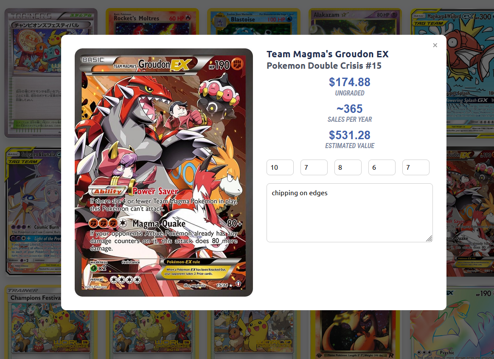

+++
title = "Miscellaneous"
template = "article.html"
[extra]
banner = "banner.webp"
+++

## Pokemon Card Database
Over the summer, I was going through my elementary/middle school Pokemon card collection. However, it was sorted into a ton of different binders, which made it really hard to search through it.

I developed this app as a way to show all of my cards in one place in a way where I could easily search through them and get price data. I used a web scraper for the [pricecharting](https://www.pricecharting.com/) website after scanning all my cards in. With this and the CSV file that I could export from the website, I could get price data and use it to analyze my cards. I current have a display of the graded value of the card, and have input boxes where I can save notes about the condition of the card.

Then, I developed a backend for the website using Flask (since it easily integrates with my web scraping data), and I can host it locally. It has worked well so far and has been a huge help when cataloguing my cards.

## Linux Laptop
When I got my laptop for college, I wanted to try something new with my operating system. I configured my laptop to dual boot Windows and Linux, and started customizing my Linux installation. I have definitely learned a lot about operating systems from fixing issues that I've had with the Linux install. For example, I once installed the wrong version of Nvidia drivers, causing my computer to boot to a black screen. I was able to chroot into the install and fix the issue. However, this taught me about how drivers work when rendering the computer screen. Overall, it's been a great experience, even if I still mainly use Windows.